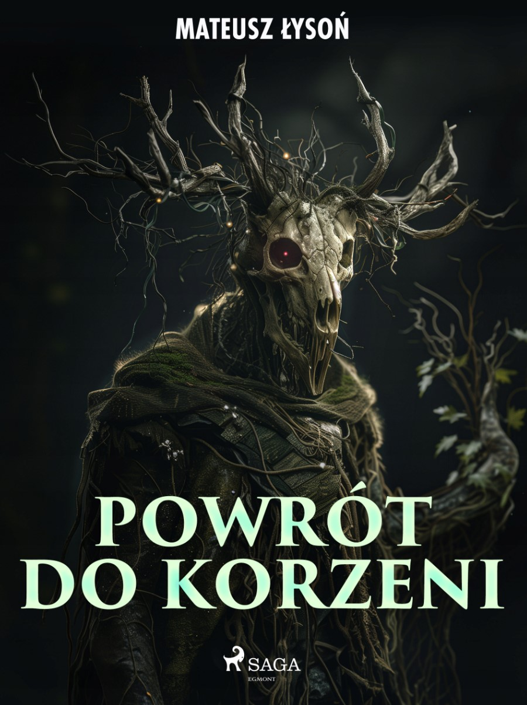

# Roots Mobile Game

## Watch the Gameplay

Click below to watch a gameplay video:

---

**Roots** is a mobile game based on a specific story from the fantasy novel *Back to the Roots* (*Powrót do Korzeni*), written by myself, **Mateusz Łysoń**, and published by **Egmont**.

  

---

## Roots Mobile Game Design

Below are some key design concepts for the **Roots Mobile Game** project.

### Core Gameplay With Buildings Dependencies

  
  

### Quests

  

### UX/UI

  

### Level Design

  

### Narrative With Tutorial

  

### Gods and Minigames 

  

### Monetization

  

---

## Other Projects

### [2D Platformer Game](https://github.com/sensorbtf/2DPlatformerGame)
A classic 2D platformer game developed in Unity, backed up with articles about the development process and learning Unity. This game features engaging mechanics such as jumping, dashing, and interactive environments. Dive into the fun world of platforming with dynamic level designs and character movement.

### [Aircrafts](https://github.com/sensorbtf/Aircrafts)
An exciting prototype (still in design) focused on developing a military base in the desert and fighting bug-like creatures.

https://github.com/user-attachments/assets/bbb22a00-6970-46e9-9786-8005d0f57992

---
